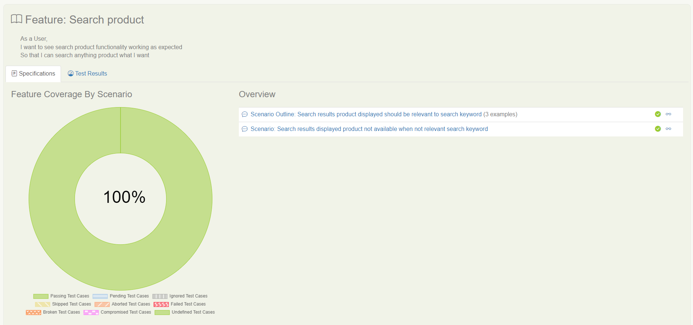
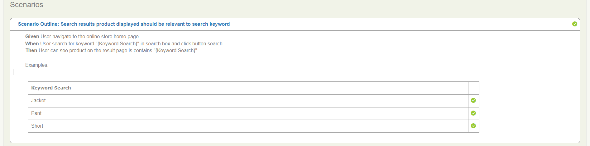
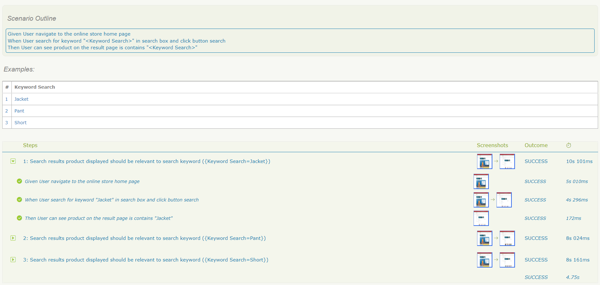

# Serenity-BDD Web And Api Testing Starter Project 

This Project Web Automation And Api Testing Using Selenium, Cucumber, JUnit, RestAssured and Serenity BDD for Reporting

## Required

1. Download [Java OpenJDK 17](https://jdk.java.net/java-se-ri/17)
   [Tutorial Installation Java in Windows](https://www.petanikode.com/java-windows/)

2. Download [Maven](https://maven.apache.org/download.cgi?Preferred=ftp://ftp.osuosl.org/pub/apache/)

`*If your computer already installed Java and Maven, you can skip step number 1 and 2.`

## Added New Scenario BDD

In order to added some Scenario BDD, we can create new file feature in directory `src/test/resources/features`

## Writing the step definitions (Breaking Down Scenario BDD Into Steps)

In order to translate the steps from Scenario BDD into executable actions, we write Java classes called Step Definitions
in directory `src/test/java/steps`

## Writing the Page Object Class

Page Objects are a way of isolating the implementation details of a web page inside a class, exposing only
business-focused methods related to that page. We can create new Page Object file in
directory `src/test/java/pageobjects`

## Running Test Case with Configure Headless Mode

You can configure your test running headless mode or not.\
in file `serenity.conf` you can modified field `headless.mode`with value `true` or `false`.\
file `serenity.conf` located in folder `src/test/resources`.

```
headless.mode = true
```

or

```
headless.mode = false
```

## Running Test Case with Default Environment

```
mvn clean verify
```

## Running Test Case with Tag Name 

```
mvn clean verify -Dcucumber.filter.tags="@C1092"

```

## Running Test Case with Tag Name Parallel
 
```
mvn clean verify -Dcucumber.filter.tags="@Web"

```

## Running Test Case with Specific Environment (file `serenity.conf`)

file `serenity.conf` located in folder `src/test/resources`

```
mvn clean verify -Denvironment=value
```

## See Report Serenity BDD

- file report located in `target/site/serenity/{dateFormat}/index.html`



- Specific Test Details



